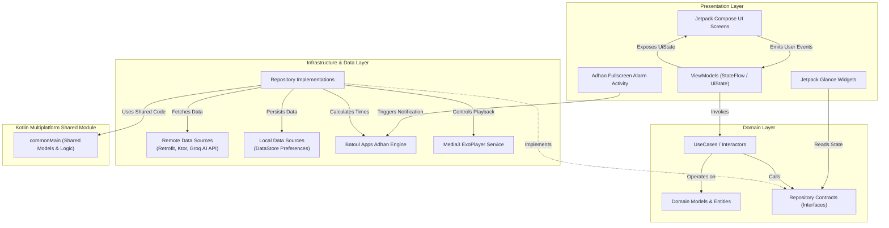
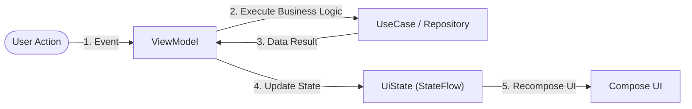

# SĀAT (ساعات) — Modern & Elegant Islamic Companion App

<div align="center">


**Sāat (ساعات)** is a modern Muslim companion application designed for the Android platform and powered by a **Kotlin Multiplatform (KMP)** architecture. Combining serene **Material 3** aesthetics, an ad-free experience, and comprehensive spiritual functionality to accompany every moment of your daily worship.

[Key Features](#key-features) • [Architecture & Tech Stack](#architecture--tech-stack) • [System Requirements](#system-requirements) • [Setup Guide](#setup--configuration) • [Build & Release](#build--release)

</div>

---

## Key Features

### 1. Precision Prayer Times & Adhan Alarm
* **Accurate Calculations**: Powered by the `Adhan` library for precise prayer time calculations based on actual location coordinates (GPS / Network).
* **Full-Screen Adhan Alarm (`AdhanAlarmActivity`)**: Dedicated full-screen alarm view when prayer time arrives with crisp adhan audio and intuitive notification controls.
* **Upcoming Prayer Countdown**: Real-time summary and countdown for upcoming prayer times.

### 2. Digital Al-Quran & Audio Recitation
* **Surah & Verse Reader**: Comfortable reading view with Arabic text and translations alongside customizable font scaling.
* **Audio Recitation**: High-quality murottal playback using **AndroidX Media3 ExoPlayer** with background audio playback support.
* **Quran Foundation Integration**: Secure integration using **OAuth 2.0 PKCE Flow** via Custom Tabs for continue-reading sessions and bookmark synchronization.

### 3. Digital Qibla Compass
* **Real-Time Sensor Orientation**: Accurate Qibla direction locator utilizing device magnetometer and accelerometer sensors.

### 4. Spiritual Tools Suite
* **Digital Tasbih / Dhikr Counter**: Interactive dhikr counter with tactile haptic feedback response.
* **Supplications & Dhikr**: Comprehensive collection of daily supplications alongside **Manzil** recitations.
* **Qiyamullail Assistant**: Night prayer tracker and notification guide.
* **Zakat & Faraidh Calculators**:
  * **Zakat Calculator**: Detailed calculations for Zakat Maal (Savings, Gold, Income) and Zakat Fitrah.
  * **Faraidh Calculator**: Islamic inheritance division calculator compliant with Sharia law.

### 5. AI-Powered Spiritual Reflection
* **AI Reflection**: Daily Islamic reflection draft feature on the *Today* tab powered by generative LLM APIs (Groq API).

### 6. Home Screen Widget (Jetpack Glance)
* **Glance App Widget (`PrayerNextGlanceWidget`)**: Upcoming prayer time information placed directly on the Android home screen with minimal battery consumption.

---

## Architecture & Tech Stack

This application adheres strictly to Google's recommended modern Android architecture guidelines, leveraging **Clean Architecture**, **Layered Separation of Concerns**, and **Unidirectional Data Flow (UDF)**.

### System Architecture Overview



### Unidirectional Data Flow (UDF)



### Core Tech Stack

| Component | Technology / Library |
| :--- | :--- |
| **Primary Language** | Kotlin 2.0.21 |
| **Multiplatform Architecture** | Kotlin Multiplatform (KMP) |
| **UI Framework** | Jetpack Compose + Material 3 (BOM `2024.12.01`) |
| **Dependency Injection** | Hilt `2.52` |
| **Async & Concurrency** | Kotlin Coroutines `1.9.0` + StateFlow |
| **Prayer Times** | Batoul Apps `Adhan 1.2.1` |
| **Media Player** | AndroidX Media3 ExoPlayer `1.4.1` |
| **Networking** | Retrofit `2.11.0` + OkHttp `4.12.0` + Kotlinx Serialization |
| **OAuth Authentication** | OpenID `AppAuth 0.11.1` (PKCE Flow) |
| **App Widget** | AndroidX Glance `1.1.1` |
| **Local Storage** | DataStore Preferences `1.1.1` + Encrypted SharedPreferences |
| **Telemetry & Debugging** | Prowl `1.0.1` |

---

## Project Module Structure

```text
Saat-Android/
├── app/                          # Android Application Module
│   └── src/main/java/app/kamy/saatApp/
│       ├── core/                 # Core Utilities, Extensions & Base Classes
│       ├── design/               # Material 3 Theme, Color Palette, Typography & UI Components
│       ├── di/                   # Dependency Injection Modules (Hilt)
│       ├── domain/               # Business Logic, Models & Use Cases
│       ├── features/             # Feature Modules / UI Screens
│       │   ├── account/          # User Profile & Settings
│       │   ├── quran/            # Surah Index & Bookmarks
│       │   ├── reader/           # Ayah Reading View & Audio Player
│       │   ├── share/            # Verse & Quote Sharing
│       │   ├── today/            # Home Dashboard: Prayer Times, AI Reflection, Hijri Date
│       │   └── tools/            # Tasbih, Qibla, Zakat, Faraidh, Supplications/Manzil, Qiyam
│       └── infrastructure/       # Repository Implementations & Network Clients
├── shared/                       # Kotlin Multiplatform (KMP) Shared Module
│   └── src/
│       ├── commonMain/           # Shared Business Logic (Android & iOS)
│       ├── androidMain/          # Android-Specific Implementations
│       └── iosMain/              # iOS-Specific Implementations
├── build_release.sh              # Interactive Script for Building AAB / APK
└── local.properties.example      # Secrets & Environment Configuration Template
```

---

## System Requirements

Ensure your development environment meets the following minimum requirements:

- **JDK**: Java Development Kit (JDK) 17
- **Android Studio**: Android Studio Ladybug / Koala (or newer)
- **Minimum Android SDK**: API Level 26 (Android 8.0 Oreo)
- **Target Android SDK**: API Level 35 (Android 15)
- **Gradle Version**: 8.13+ (with AGP 8.13.2)

---

## Setup & Configuration

### 1. Clone the Repository
```bash
git clone https://github.com/elmeeee/Qalbu-Android-App.git
cd Qalbu-Android-App
```

### 2. Configure `local.properties`
Create your local environment file by copying `local.properties.example`:

```bash
cp local.properties.example local.properties
```

Populate the required credentials in `local.properties`:

```properties
# Quran Foundation OAuth client secrets
QF_OAUTH_CLIENT_SECRET_DEBUG=your_debug_client_secret
QF_OAUTH_CLIENT_SECRET_RELEASE=your_release_client_secret

# Groq API Key (Optional: Powers AI Reflection on Today tab)
API_KEY_GROQ=your_groq_api_key
AI_MODEL=qwen/qwen3-32b

# Release Signing Keystore (For production release builds)
RELEASE_STORE_FILE=keystore/saat-release.jks
RELEASE_STORE_PASSWORD=your_store_password
RELEASE_KEY_ALIAS=saat
RELEASE_KEY_PASSWORD=your_key_password
```

### 3. Build & Run
Open the project in **Android Studio**, wait for Gradle sync to complete, select the `app` run configuration, and run on an Emulator or connected Android device.

Alternatively, build via the command line:
```bash
./gradlew assembleDebug
```

---

## Build & Release

The project includes an interactive build assistant `./build_release.sh`.

Execute the script from the root directory:
```bash
chmod +x build_release.sh
./build_release.sh
```

The interactive CLI wizard will prompt you to build:
1. **AAB (Android App Bundle)** — Ready for Google Play Store upload (`app/build/outputs/bundle/release/app-release.aab`)
2. **APK (Android Package)** — Ready for QA testing / Direct installation (`app/build/outputs/apk/release/app-release.apk`)
3. **Both (AAB & APK)**

---

## License & Copyright

© 2026 **Elmee**. All Rights Reserved.

---
<div align="center">
  <i>Built with devotion to enrich your daily spiritual journey.</i>
</div>
