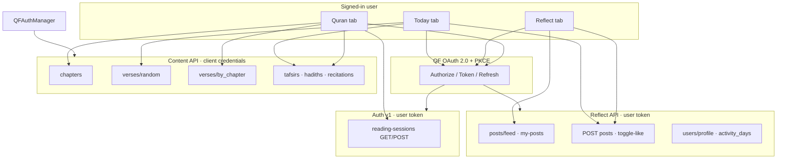

# Saat (Al-khatib-Qalbu)

**A daily Quran companion for iOS** — read with tajweed and audio, understand with tafsir and hadith, reflect with the community, and pick up where you left off.

| | |
|---|---|
| **Platform** | iOS 26 · SwiftUI · Swift 6 concurrency |
| **Repository** | [github.com/elmeeee/Al-khatib-Qalbu](https://github.com/elmeeee/Al-khatib-Qalbu) |
| **QF environment** | Prelive (Debug) · Production (Release) |

---

### Project Name

**Saat**

### One-sentence summary

Saat is an iOS app that connects daily Quran reading (verse of the day, full surah reader, audio, tafsir, and hadith) with Quran Reflect community reflections and cross-device continue-reading via Quran Foundation APIs.

### What problem does your project solve?

Many Muslims want to read and reflect on the Quran regularly, but daily practice is fragmented across separate apps (reading, audio, tafsir, journaling, community). Saat unifies **read → understand → reflect → resume** in one calm, mobile-first experience anchored on official Quran Foundation content and Reflect APIs.

### How does your project help people engage with the Quran?

- **Today** surfaces a random ayah with Uthmani tajweed, English translation, recitation audio, and Ibn Kathir tafsir (QF Content API).
- **Quran** tab offers a vertical chapter reader with per-ayah audio, play-entire-surah, tafsir, related hadith, and **continue reading** synced through Auth v1 reading sessions.
- **Reflect** tab delivers a full-screen community feed (QF Reflect API) with likes; users can publish reflections tied to the current ayah after signing in with Quran Foundation OAuth.
- **Prayer times** (Al-Adhan, not QF) give daily rhythm context on the Today screen.

Engagement is intentional: short daily touchpoints, deeper surah study, and social reflection on the same verses.

### Who is the primary audience?

**Muslims (especially English-speaking users)** who want a single iOS app for daily Quran habit, guided understanding (tafsir/hadith), and optional participation in the **Quran Reflect** community — without switching between multiple tools.

---

## Table of contents

1. [Features by tab](#features-by-tab)
2. [Quran Foundation API integration](#quran-foundation-api-integration)
3. [External services (non-QF)](#external-services-non-qf)
4. [Authentication model](#authentication-model)
5. [Architecture](#architecture)
6. [Getting started](#getting-started)
7. [License & credits](#license--credits)

---

## Features by tab

### Today

- Random ayah (`GET /content/api/v4/verses/random`) with tajweed HTML, translation, and audio URL from verse payload
- Play / pause recitation (audio URLs resolved via `verses.quran.com` base)
- Tafsir sheet (Ibn Kathir, resource id `169`)
- Optional AI-assisted reflection draft (Groq — **not** a QF API; requires `API_KEY_GROQ`)
- Publish reflection to Quran Reflect (`POST /quran-reflect/v1/posts`) when signed in
- Prayer dashboard (Al-Adhan API + Core Location)
- Share card (verse image / text)

### Reflect

- Vertical reel-style feed: community posts (`GET .../posts/feed`) and my posts (`GET .../posts/my-posts`)
- Like posts (`POST .../posts/:id/toggle-like`)
- Requires Quran Foundation OAuth (user access token)
- Comment, bookmark, and share actions are **hidden** until backed by APIs

### Quran (Journey)

- Chapter list (`GET .../chapters`) with in-memory cache (1 hour TTL)
- Vertical ayah reader with pagination (`GET .../verses/by_chapter/:number`)
- Per-ayah and play-all-surah audio (recitation id `6` by default; list from `GET .../resources/recitations`)
- Tafsir per ayah, hadith references per ayah
- Continue reading card from `GET /auth/v1/reading-sessions` (most recent session)
- Background reading progress via `POST /auth/v1/reading-sessions` (debounced tracker while scrolling)

### Account / Settings

- Sign in / sign out (OAuth 2.0 + PKCE)
- Profile from Reflect (`GET .../users/profile`)
- Prayer calculation method preferences (local + Al-Adhan query params)

---

## Quran Foundation API integration

All QF paths below are relative to the configured API base:

| Build | Base URL |
|-------|----------|
| **Debug (Prelive)** | `https://apis-prelive.quran.foundation` |
| **Release (Production)** | `https://apis.quran.foundation` |

Full URL pattern: `{base}/{prefix}/{path}`

| Prefix | Used for |
|--------|----------|
| `content/api/v4` | Content API (client credentials token) |
| `quran-reflect/v1` | Reflect API (user OAuth token) |
| `auth/v1` | Auth v1 user APIs (user OAuth token) |

OAuth host (separate from API base):

| Build | Authorize | Token |
|-------|-----------|-------|
| Prelive | `https://prelive-oauth2.quran.foundation/oauth2/auth` | `.../oauth2/token` |
| Production | `https://oauth2.quran.foundation/oauth2/auth` | `.../oauth2/token` |

| Build | Registered redirect URI (QF) | App callback (ASWebAuthenticationSession) |
|-------|------------------------------|-------------------------------------------|
| **Debug (Prelive)** | `Saat://oauth/callback` | `Saat://oauth/callback` |
| **Release (Production)** | `https://elmee.my/oauth/callback` | `Saat://oauth/callback` (bridge from [elmee.my](https://elmee.my/oauth/callback)) |

### OAuth 2.0 (user identity)

| Capability | Endpoint | Method | Used in app |
|------------|----------|--------|-------------|
| Authorization (PKCE) | `/oauth2/auth` | Browser (`ASWebAuthenticationSession`) | Sign in from Profile / gated Reflect |
| Token exchange | `/oauth2/token` | `POST` | Code → access + refresh tokens |
| Token refresh | `/oauth2/token` | `POST` | Silent refresh via `QFRefreshTokenManager` |
| Introspect | `/oauth2/introspect` | `POST` | Implemented in client; **not called** from UI |

**Requested scopes** (`QF_OAUTH_SCOPES` in `Config/Debug.xcconfig` and `Config/Release.xcconfig`):

```
openid offline_access user post streak activity_day reading_session
```

| Scope area | How the app uses it |
|------------|---------------------|
| `openid`, `offline_access`, `user` | Sign-in, profile, token refresh |
| `post` | Create reflections, feed, likes |
| `activity_day` | Log Quran activity when publishing a post with verse references |
| `reading_session` | Continue reading + background session sync |
| `streak` | Requested in OAuth scope; **no streak UI** in current build |

Implementation: `QFOAuthService.swift`, `QFUserSession.swift`, `QFApiClient.swift`

---

### Content API (`content/api/v4`)

**Authentication:** OAuth2 **client credentials** → content access token (`QFAuthManager`)

| Endpoint | Method | Query / body highlights | Feature / screen |
|----------|--------|-------------------------|------------------|
| `/chapters` | `GET` | `language=en` | Quran tab — surah list |
| `/verses/random` | `GET` | `language=en`, `translations=85`, `audio=6`, verse `fields` (Uthmani + tajweed), `translation_fields=resource_name` | Today — verse of the day |
| `/verses/by_chapter/{chapterNumber}` | `GET` | Same as random + `page`, `per_page` (max 50) | Quran reader — paginated ayahs |
| `/resources/recitations` | `GET` | `language=en` | Recitation picker / audio metadata |
| `/tafsirs/{resourceId}/by_ayah/{ayahKey}` | `GET` | Resource `169` (Ibn Kathir) | Today tafsir, reader tafsir sheet |
| `/hadith_references/by_ayah/{ayahKey}/hadiths` | `GET` | `language=en`, `page`, `limit` (≤5) | Reader — hadith panel |

**Verse payload fields consumed:**

- `text_uthmani`, `text_uthmani_tajweed` — Arabic display (tajweed rendered in `WKWebView` via bundled tajweed font)
- `translations[]` — English (resource id 85 in queries)
- `audio` — relative or absolute URL; resolved with `QF_VERSES_WEB_BASE` (`https://verses.quran.com`)

**Defined but not wired to UI:**

- `GET /verses/by_key/{key}` — path constant in `AppEndpoints.Content.verseByKey`; no repository call

Implementation: `QuranContentEndpoints.swift`, `QuranContentRepository.swift`, `TafsirPresenter.swift`

---

### Quran Reflect API (`quran-reflect/v1`)

**Authentication:** User **access token** from OAuth (Bearer)

| Endpoint | Method | Query / body | Feature / screen |
|----------|--------|--------------|------------------|
| `/users/profile` | `GET` | — | Profile, feed bootstrap (author id) |
| `/users/profile` | `PATCH` | `{ "post_as": bool }` | `patchMyProfileNoop` — **not used** in UI |
| `/posts/feed` | `GET` | `tab=feed`, `sortBy=latest`, `page`, `limit`, `filter[postTypeIds]=1` | Reflect — All Reflect |
| `/posts/my-posts` | `GET` | `tab=my_reflections`, `sortBy=latest`, `page`, `limit` | Reflect — My Reflect |
| `/posts` | `POST` | Post body, verse `references`, `post_as_author_id`, `published_at`; optional `Idempotency-Key` | Today — publish reflection; Reflect create |
| `/posts/{postId}/toggle-like` | `POST` | — | Reflect reel — heart button |
| `/activity_days` | `POST` | `{ type: "QURAN", day, timezone, verses_read }` | Called after successful post **with** verse references (`UserHabitRepository`) |

**Defined but not wired to UI:**

- `GET /posts` (generic list enum case) — unused

Implementation: `ReflectEndpoints.swift`, `ReflectRepository.swift`, `UserHabitRepository.swift`, `ReflectionViewModel.swift`

---

### Auth v1 API (`auth/v1`)

**Authentication:** User **access token** (scope: `reading_session`)

| Endpoint | Method | Query / body | Feature / screen |
|----------|--------|--------------|------------------|
| `/reading-sessions` | `GET` | Cursor: `first`, `after`, `last`, `before` | Quran — “Continue reading” (uses `first=1` only) |
| `/reading-sessions` | `POST` | `{ "chapter_number", "verse_number" }` | `ReadingSessionTracker` while user scrolls reader |

Implementation: `ReadingSessionEndpoints.swift`, `ReadingSessionRepository.swift`, `ReadingSessionTracker.swift`

---

### API usage summary diagram



---

## External services (non-QF)

| Service | Purpose | Not part of QF API |
|---------|---------|-------------------------------------|
| **[Al-Adhan](https://aladhan.com/prayer-times-api)** | Daily prayer times from GPS + calculation method | Today prayer card |
| **[Groq](https://groq.com)** (optional) | LLM draft for personal reflection text | Today “Reflect” assist when `API_KEY_GROQ` is set |
| **`verses.quran.com`** | Absolute URLs for verse audio paths returned by Content API | Audio player |

---

## Authentication model

| API surface | Token type | How obtained |
|-------------|------------|--------------|
| Content API | Client credentials access token | `QFAuthManager` (cached in Keychain) |
| Reflect API | User access token | OAuth authorization code + PKCE |
| Auth v1 | User access token | Same as Reflect |
| Token refresh | Refresh token | Keychain via `QFUserSession`; auto-refresh on 401 |

Sign-out clears OAuth session, local reflection store, widget keys, and content token cache (`AppContainer.signOut()`).

---

## Architecture

```
Saat/
├── App/                 AppContainer, RootTabView, TodayVerseState
├── Core/                AppEndpoints, Configuration, QuranVerseArabic
├── Networking/          QFApiClient, QFOAuthService, QFEndpoint, Endpoints/*
├── Services/            Repositories (Content, Reflect, ReadingSession, habits)
├── Features/
│   ├── Discovery/       Today (verse, prayer, share, reflect publish)
│   ├── Reflection/      Reflect reel feed
│   ├── Chapter/         Quran reader + audio
│   └── Settings/        Profile, OAuth, prayer settings
├── Design/              Theme, Arabic WebView, buttons
├── Models/              API decodable types
└── Persistence/         Local reflection store (sync helper present; queue unused)
```

- **SwiftUI** + `@Observable` / view models
- **async/await** networking through typed `QFEndpoint` protocol
- **Keychain** for tokens and OAuth client secret
- **App Group** `group.co.kamy.Saat` for shared defaults (widgets / extensions)

---

## Getting started

### Requirements

- Xcode 16+
- iOS 26 simulator or device
- Quran Foundation OAuth client (Prelive for Debug, Production for Release)
- Client secret for Content API (client credentials)

### Configure secrets

1. Copy the example secrets file:

   ```bash
   cp Config/Secrets.xcconfig.example Config/Secrets.xcconfig
   ```

2. Edit `Config/Secrets.xcconfig`:

   | Key | Purpose |
   |-----|---------|
   | `QF_OAUTH_CLIENT_SECRET_DEBUG` | Prelive client secret |
   | `QF_OAUTH_CLIENT_SECRET_RELEASE` | Production client secret |
   | `API_KEY_GROQ` | Optional — AI reflection drafts on Today |
   | `AI_MODEL` | Optional — Groq model id (default `qwen/qwen3-32b`) |

3. Ensure your QF OAuth app allows the redirect URI for your build (`Saat://oauth/callback` for Prelive; `https://elmee.my/oauth/callback` for Production) and scopes matching `QF_OAUTH_SCOPES` in `Config/Debug.xcconfig` / `Release.xcconfig`.

4. After changing scopes, **sign out and sign in again** so a new refresh token is issued.

### Build & run

1. Open `Saat.xcodeproj` in Xcode.
2. Select the **Saat** scheme and an iPhone simulator (e.g. iPhone 17).
3. **Product → Run** (⌘R).

---

## License & credits

- **Quran text, audio, tafsir, and Reflect data** — [Quran Foundation](https://quran.foundation) APIs
- **Prayer times** — [Al-Adhan API](https://aladhan.com)
- **App** — Saat

For questions or demo access, open an issue on the GitHub repository.
